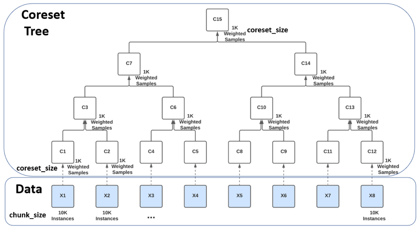

<style>
  li ul li{
   list-style-type: lower-alpha;
   }
</style>
Last updated on Feb 17, 2023

### Coresets and Coreset Trees
A Coreset is a weighted subset of samples from a larger dataset, selected in such a way that the selected samples maintain the statistical properties and corner cases of the full dataset such that training an algorithm on the Coreset will yield the same results as training that same algorithm on the full dataset.

The DataHeroes library can be used to build a Coreset as well as to build and maintain a more complex Coreset Structure, known as a Coreset Tree. Once the Coreset or Coreset tree is built, various data science operations can be performed on it, such as training a model, updating labels and removing samples.

Unlike a Coreset which is built over the entire dataset in one iteration, a Coreset Tree is comprised of multiple Coresets, each built separately for a chunk (batch) of the dataset (`chunk_size`) and then combined iteratively in a tree-like manner. 

In the illustration below, the entire dataset was split into 8 chunks, of 10K instances each (X1, …, X8) and a Coreset of up to 1K samples (`coreset_size`) was built for each chunk separately (C1, C2, C4, …, C12). Every pair of Coresets is then combined into a new Coreset, in a tree-like hierarchy, with the root being the minimal subset, called the root Coreset (C15).

The Coreset Tree data structure has several advantages over a single Coreset computed over the entire dataset:

- A single Coreset requires the entire dataset to fit into the device’s memory and is therefore limited in the size of datasets it can handle. A Coreset Tree, does not have this limitation as it processes the dataset in chunks and can therefore handle any dataset size by splitting the data into the appropriate number of chunks.
- A Coreset Tree can be computed much faster since the Coresets’ computation can be distributed across a cluster of devices or processors.
- In a Coreset Tree, additional data can be added to the original dataset without requiring re-computation of the entire Coreset Tree. A Coreset just needs to be built for the additional data and then that Coreset is added to the Coreset Tree, while updating only the necessary Coreset nodes on the path to the root Coreset. This makes it a great structure to use for model maintenance in production.
- Similarly, updating the target or features of existing instances or removing instances, does not require re‑computation of the entire Coreset Tree, updating the Coreset nodes on the path to the root Coreset will suffice. E.g.: If we updated the target for some instances in X6, all we need to do to keep the Coreset Tree updated, is to update the Coresets C9, C10, C14 and C15, while the rest of the Coresets remain unchanged.

The main disadvantage of the Coreset Tree versus a single Coreset computed over the entire dataset, is that each level of the Coreset tree increases the approximation error, therefore leading to a slightly less accurate root Coreset. However, this error can be controlled and decreased easily, by increasing the `coreset_size`.

Another disadvantage of the Coreset tree versus a single Coreset is that in every level of the tree we lose some “outliers” which are not carried over from the previous level down. Hence the more levels a tree has, the less “outliers” remain in its root coreset. This can be controlled as well by indicating to the <a href="reference/services/tree_services/#services.tree_services.CoresetTreeService.build">`build()`</a> function when building the Coreset, whether it should be optimized for training (more levels) or for cleaning (a single level).

### Building a Coreset or Coreset Tree
The class representing the Coreset Tree in the DataHeroes library is named CoresetTreeService. While the `chunk_size` and `coreset_size` can be passed as parameters to the class, the default behavior is for them to be automatically calculated by the class when the Coreset is built based on the quadruplet: ‘number of­ instances’, ‘number of features’ (deduced from the dataset), ‘number of classes’ (if passed, otherwise deduced from the dataset) and the ‘memory’ (if passed, otherwise deduced based on the device’s memory). Based on this quadruplet the class will also decide whether to build an actual Coreset Tree or to build a single Coreset over the entire dataset. In the case of a single Coreset, every time additional data is added to the class using the partial_build function, the class will assess whether it is worth moving to an actual Coreset Tree, and will automatically convert the structure as necessary.

To build the Coreset Tree, use the standard <a href="reference/services/tree_services/#services.tree_services.CoresetTreeService.build">`build()`</a> function or one of its sibling functions – <a href="reference/services/tree_services/#services.tree_services.CoresetTreeService.build_from_df">`build_from_df()`</a> or <a href="reference/services/tree_services/#services.tree_services.CoresetTreeService.build_from_file">`build_from_file()`</a>.

<a target="_blank" href="https://github.com/Data-Heroes/dataheroes/blob/master/examples/coreset_tree_service/build_options_tabular_data_covertype.ipynb">See the build options tutorial here.</a>

### Data Cleaning Use Case
You can use a Coreset property referred to as Importance (or Sensitivity) to systematically identify potential errors and anomalies in your data. When building a Coreset, every instance in the data is assigned an Importance value, which indicates how important it is to the final machine learning model. Instances that receive a high Importance value in the Coreset computation, require attention as they usually indicate a labeling error, anomaly, out-of-distribution problem or other data-related issue. This version allows you to find the important samples in the dataset, regardless of what algorithm you use to train your model.

To review data instances based on their importance, first build a Coreset using any <a href="reference/services/tree_services/#services.tree_services.CoresetTreeService.build">`build()`</a> function, while setting the parameter `optimized_for` to 'cleaning', then use the <a href="reference/services/tree_services/#services.tree_services.CoresetTreeService.get_important_samples">`get_important_samples()`</a> function to get the samples with the highest importance, for the classes of interest. 

When you find incorrectly labeled samples, use the <a href="reference/services/tree_services/#services.tree_services.CoresetTreeService.update_targes">`update_targets()`</a> function to update their labels or remove the samples using the <a href="reference/services/tree_services/#services.tree_services.CoresetTreeService.remove_samples">`remove_samples()`</a> function. Any such change to the samples will automatically update the Coreset data structure to reflect the changes. 

Should you prefer to suppress these updates until you finish all your changes, set the force_do_nothing flag to True when calling the <a href="reference/services/tree_services/#services.tree_services.CoresetTreeService.update_targets">`update_targets()`</a> or <a href="reference/services/tree_services/#services.tree_services.CoresetTreeService.remove_samples">`remove_samples()`</a> functions and call the <a href="reference/services/tree_services/#services.tree_services.CoresetTreeService.update_dirty">`update_dirty()`</a> function to update the Coreset data structure when you’re ready. More advanced cleaning techniques can be applied by using filters with the <a href="reference/services/tree_services/#services.tree_services.CoresetTreeService.filter_out_samples">`filter_out_samples()`</a> function.

When cleaning, it is important to remember that both the train and test dataset should be cleaned to maintain a high quality, non-biased test.

<a target="_blank" href="https://github.com/Data-Heroes/dataheroes/tree/master/examples/cleaning">See data cleaning tutorials here.</a>

### Training and Hyperparameter Tuning Use Case
Using our much smaller Coreset structure, you can train or tune your model orders of magnitude faster and consume significantly less compute resources and energy, compared to using the full dataset. 

Use the DataHeroes’ library <a href="reference/services/tree_services/#services.tree_services.CoresetTreeService.fit">`fit()`</a> function to fit a model on the Coreset and the <a href="reference/services/tree_services/#services.tree_services.CoresetTreeService.predict">`predict()`</a> function to run predictions on the model. Alternatively, if you prefer to use other libraries for training, use the <a href="reference/services/tree_services/#services.tree_services.CoresetTreeService.get_coreset">`get_coreset()`</a> function to retrieve a numpy array or pandas dataframe version of the Coreset which can be used with other libraries. 

To check the quality of your Coreset, you can fit a model and compare its predictions to predictions from a model built using your full dataset. To decrease the approximation error in the case of a Coreset Tree, requesting level 1 or 2 instead of the default level 0 when calling <a href="reference/services/tree_services/#services.tree_services.CoresetTreeService.get_coreset">`get_coreset()`</a> will return the requested level from the Coreset Tree.

The current version provides a Coreset optimized for training with the logistic regression algorithm (upcoming versions will provide additional Coresets optimized for other algorithms). To build the Coreset or Coreset Tree use any <a href="reference/services/tree_services/#services.tree_services.CoresetTreeService.build">`build()`</a> function to build the CoresetTreeServiceLG, while setting the parameter optimized_for to 'training’.

<a target="_blank" href="https://github.com/Data-Heroes/dataheroes/blob/master/examples/coreset_tree_service/all_library_functions_tabular_data_covertype.ipynb">See the tutorial explaining the usage of functions in the library here.</a>

### Model Maintenance Use Case
You can use the Coreset Tree structure to update models in production when new data comes in, by updating the Coreset Tree with the new data and training the model on the Coreset, without having to re-train the model on the full dataset.

After building the Coreset Tree using one of the <a href="reference/services/tree_services/#services.tree_services.CoresetTreeService.build">`build()`</a> functions, you can add additional data to the Coreset Tree using the <a href="reference/services/tree_services/#services.tree_services.CoresetTreeService.partial_build">`partial_build()`</a> function or one of its sibling functions <a href="reference/services/tree_services/#services.tree_services.CoresetTreeService.partial_build_from_df">`partial_build_from_df()`</a> and <a href="reference/services/tree_services/#services.tree_services.CoresetTreeService.partial_build_from_file">`partial_build_from_file()`</a>, and retrain the model as explained above.

### <span style="color:#2F5496"><ins>Getting Started</ins></span>
1. Create a free account on https://dataheroes.ai/getting-started/.
2. Install the library on your device by running: `pip install dataheroes`.
3. Activate your account by executing the following code once (from each device you’re using):
```
from dataheroes.utils import activate_account
activate_account("john.doe@gmail.com")
```
4. Check out our documentation and examples available <a target="_blank" href="https://dataheroes.ai/tutorials/">here</a>.
### <span style="color:#2F5496"><ins>Other library dependencies</ins></span>
The DataHeroes library has dependency on other libraries. Please note that when installing the DataHeroes library, older versions of other libraries you may be using, may get automatically updated. The table below shows the minimum version required from each library the dataheroes library depends on.

| Library                     | Minimum Version |
|-----------------------------|-----------------|
| numpy                       | 1.19.0          |
| scipy                       | 1.7.0           |
| scikit-learn                | 0.24.0          |
| pandas                      | 1.0.0           |
| joblib                      | 0.15.0          |
| threadpoolctl               | 2.1.0           |
| networkx                    | 2.5             |
| pydot                       | 1.4.1           |
| matplotlib                  | 3.3.0           |
| opentelemetry-sdk           | 1.14.0          |
| opentelemetry-api           | 1.14.0          |
| opentelemetry-exporter-otlp | 1.14.0          |
| psutil                      | 5.8.0           |
| licensing                   | 0.31            |
| tables                      | 3.6.1           |
